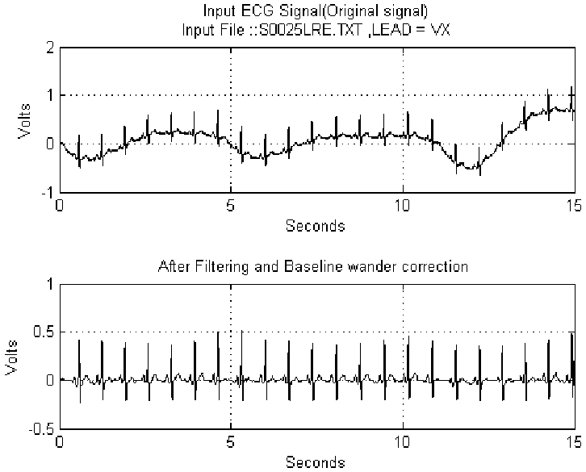
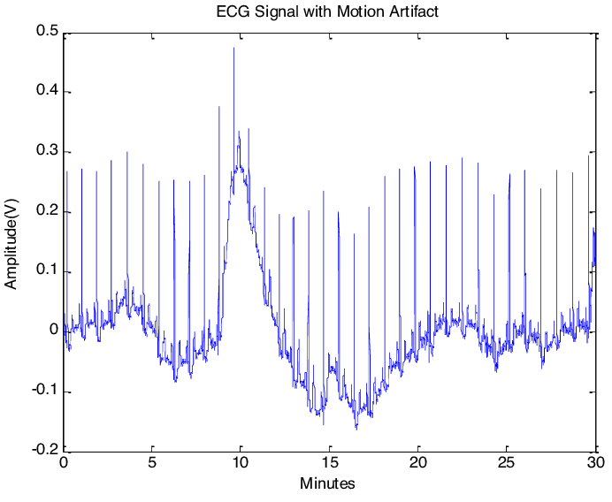
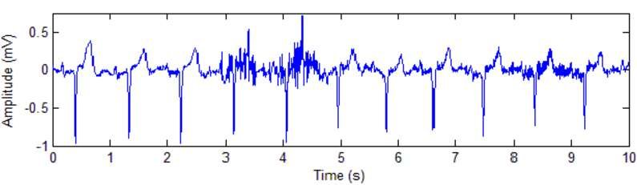

# CÁC LOẠI NHIỄU TRONG ECG
## 1. BW - Baseline Wander (Trôi đường nền)

- Đặc điểm: 
	- Là dao động chậm của đường nền ECG
	- Làm cho toàn bộ tín hiệu bị nâng lên hoặc hạ xuống từ từ 
	- Không làm méo hình dạng QSR nhiều nhưng làm sai biên độ & khó phát hiện R-peak 
- Dải tần: 
	- Rất thấp: 0.05 ~ 0.5Hz
- Nguyên nhân: 
	- Hô hấp
	- Cử động cơ thể 
	- Thay đổi tiếp xúc điện cực - da
	- Thay đổi trở kháng da theo thời gian 
	
- Cách xử lý: 
	- High-pass Filter: Cut-off thường dùng 0.5Hz
	- Polynomial fitting/spline
	- Wavelet (DWT loại bỏ scale thấp)
- Trong ECG-PPG-PCG, BW thường xuất hiện mạnh khi đeo sensor lâu hoặc bệnh nhân di chuyển

## 2. MA - Motion Artifact (Nhiễu do chuyển động)

- Đặc điểm: 
	- Nhiễu không ổn định, đột ngột
	- Có thể làm biến dạng hoặc che mất QSR
	- Biên độ có thể lớn hơn tín hiệu thật
- Dải tần: 
	- Rộng: 0.1 ~ 20Hz (hoặc hơn)
- Nguyên nhân: 
	- Bệnh nhân cử động
	- Dây điện cực rung
	- Thay đổi tiếp xúc điện cực - da
	- Ma sát cơ học
- Cách xử lý: 
	- Cố định điện cực tốt
	- Adaptive Filter
	- Wavelet Denoising (rất hiệu quả)
- Trong hệ đồng bộ cảm biến: MA là kẻ thù số 1 khi đồng bộ nhiều cảm biến 

## 3. EM - Electromyographic Noise (Nhiễu cơ - EMG)

- Đặc điểm: 
	- Nhiễu cao tần
	- Làm ECG bị răng cưa, xù
	- Dễ nhầm với nhiễu ADC hoặc jitter sampling
- Dải tần: 
	- Cao: 20 ~ 200Hz
- Nguyên nhân: 
	- Co cơ (tay, ngực, cổ)
	- Run cơ
	- Nói chuyện, căng thẳng
- Cách xử lý: 
	- Low-pass Filter: cutoff 35-45Hz
	- Notch Filter (nếu trùng với nhiễu khác)
	- Wavelet thresholding
