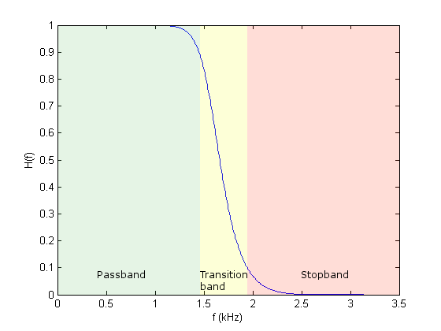

# HIỂU VỀ BỘ LỌC FIR - LÝ THUYẾT NỀN TẢNG
LuongHuuPhuc - 2025/11/30

## 1. Bộ lọc FIR là gì ? 
- FIR (Finite Impulse Response) là bộ lọc có đáp ứng xung hữu hạn 
- Nó thực hiện phép lọc bằng cách nhân tích chập (convolution) tín hiệu đầu vào với một tập hệ số (coefficients)

$$ y[n]=\sum_{k=0}^{N-1} h[k] \cdot x[n-k] $$

- Trong đó: 
	- $h[k]:$ là đáp ứng xung của bộ loc hay hệ số của bộ lọc (filter taps)
	- $N$: số tap của bộ lọc 
	- $x[n]:$ mẫu tín hiệu vào 
	- $y[n]$: mẫu lọc đầu ra
	
## 2. Đáp ứng xung (Impulse Response)
- **Khái niệm:** Đáp ứng xung là giá trị đầu ra của hệ thống khi đầu vào là 1 xung lý tưởng, ví dụ như hàm *Delta Dirac*. Nó mô tả cách hệ thống **phản ứng** ngay sau khi nhận một tín hiệu đầu vào đột ngột, giúp xác định đặc tính hoạt động của hệ thống đó 
- Hàm $h[k]$ chính là đáp ứng xung của bộ lọc
	- Với FIR: đáp ứng xung chỉ tồn tại trong N mẫu -> **Không hồi tiếp**, không tích lũy lỗi 
	- Với IIR: đáp ứng kéo dài vô tận do có hồi tiếp
	
- Ưu điểm của FIR:
	- Luôn **ổn định tuyệt đối**
	- Dễ xây dựng và độ chính xác cao
	- Có thể thiết kế có pha tuyến tính (linear phase) -> Tín hiệu không bị méo dạng sóng (rất quan trọng trong sinh học)
		- *Pha tuyến tính (linear phase) là thuật ngữ mô tả mối quan hệ hoặc đáp ứng không làm thay đổi hình dạng của tín hiệu đầu vào, thường xuất hiện trong các bộ lọc hoặc xử lý tín hiệu*
		- *Nó có nghĩa là tín hiệu được xử lý và đầu ra vẫn giữ nguyên hinh dạng ban đầu, chỉ bị dịch chuyển một cách nhất quán theo thời gian, khác với "pha phi tuyến tính (non-linear phase) làm biến dạng tín hiệu*
	
## 3. Đáp ứng tần số (Frequency Response)
- Frequency Response (đáp ứng tần số) là phép đo định lượng của phổ tần số đầu ra của một hệ thống hoặc thiết bị khi phản ứng với một kích thích tần số từ môi trường. Có thể hiểu đơn giản là việc thiết bị hoặc hệ thống phản ứng thế nào khi ta đưa vào các tín hiệu có tần số khác nhau (có bị méo, mạnh yếu ra sao)
- Đáp ứng tần số của lowpass lý tưởng là hình chữ nhật. Dưới đây là công thức mô tả đáp ứng tần số với 2 cách biểu diễn khác nhau: 

* Biểu diễn trong miền tần số **tuyệt đối** (tần số liên tục hoặc tần số tương tự). Sử dụng biến $f$:

$$
H_{\text{ideal}}(f) = \begin{cases} 
    1, & |f| < f_c \\ 
    0, & |f| > f_c 
\end{cases}
$$

* Biểu diễn trong miền tần số góc đã chuẩn hóa (Normalized), thường dùng trong hệ thống xử lý tín hiệu rời rạc (DSP). Sử dụng biến $\omega$:

$$
H(e^{j\omega}) = \begin{cases} 
    1, & |\omega| \leq \omega_c \\
    0,  & \text{khác}
\end{cases}
$$

- Cụ thể hơn, đáp ứng tần số của FIR được lấy bằng biến đổi Fourier rời rạc (DFT) của $h[k]$:

$$ H(e^{j\omega})=\sum_{k=0}^{N-1} h[k]e^{(-j\omega k)} $$

- Trong đó: 
	- $H(e^{j\omega})$: là đáp ứng tần số của bộ lọc -> cho biết bộ lọc giữ hay loại tần số nào (Tương đương miền tần số)
	- $h[k]$: là đáp ứng xung của bộ lọc, cũng là hệ số FIR (tap coefficients), chiều dài N. Đây là "tim" của bộ lọc (Tương đương miền thời gian)
	- $e^{(-j\omega k)}$: Sóng điều hòa phức để phân tích đóng góp của $h[k]$ vào mỗi tần số (pha đáp ứng tần số)	
	- $\omega$: Tần số rời rạc trong miền rad/sample
	
- Nó cho biết: 
	- Tần số nào được giữ lại
	- Tần số nào bị giảm / loại bỏ

- Từ công thức đáp ứng tần số trên (dựa vào công thức biến đổi Fourier rời rạc), do tín hiệu y sinh về mặt sinh lý thì được coi là tín hiệu tuần hoàn, nhưng xét về mặt toán học, tín hiệu y sinh không tuần hoàn
	- Lý do là vì một tín hiệu $x(t)$ được xem là tuần hoàn khi nó thỏa mãn công thức toán học sau: 
	
$$x(t) = x(t + T_{0})$$
	
- Trong đó, $T_{0}$ là chu kỳ cơ bản và điều kiện này cần phải thỏa mãn **tuyệt đối** với mọi thời điểm t và tồn tại mãi từ $−∞$ đến $+∞$
- Vì thế ta có thể tính ngược lại được các hệ số $h[k]$ bằng cách dùng **IDFT (Inverse Dicrete Fourier Transform) - Biến đổi Fourier rời rạc ngược** cho tín hiệu **không tuần hoàn**:

$$ h[n] = \frac{1}{2\pi}\int_{-\pi}^{\pi} H(e^{j\omega})e^{j\omega n}d\omega $$

- Đây cũng chính là công thức tính **Đáp ứng xung (Impulse Response)**. 
- Tuy nhiên đó chỉ là công thức lý tưởng trên lý thuyết toán học. Có thể dùng công thức đó để tính ra các bộ hệ số bộ lọc (đáp ứng xung) nhưng giá trị sẽ không đẹp và khó điều khiển được độ dốc của Transition band
- Vì thế trong thực tế trong lập trình nhúng cho xử lý tín hiệu số, người ta không dùng trực tiếp IDFT mà các hệ số của bộ lọc cần phải được thiết kế thông qua các phương pháp Windowes-sinc (Hamming, Hanning, Blackman,...) hoặc Parks-McClellan,...

## 4. Tần số cắt của bộ lọc
- Tần số cắt là tần số tại đó đáp ứng của bộ lọc bắt đầu giảm xuống và biên độ tín hiệu giảm xuống còn một nửa công suất (tương đương -3dB)
	- Với Low-pass: giữ tần số thấp, cắt tần số cao 
	- Với High-pass: giữ tần số cao, cắt tần số thấp
	- Với Band-pass: giữ một dải tần
	- Với Band-stop: loại bỏ một dải tần
	
- Tần số cắt trong bộ lọc FIR không có một công thức cố định mà được xác định bởi phương pháp thiết kế như tần số lấy mẫu hoặc phương pháp cửa sổ (window), dựa trên tần số lấy mẫu $(f_{s})$ và thông số mong muốn của bộ lọc. 
- Công thức phổ biến để xác định tần số cắt được chuẩn hóa là:

### 4.1. Phương pháp lấy mẫu tần số 
- **Tần số cắt chuẩn hóa** (biến đổi từ tần số cắt tuyệt đối $f_{c}$ sang) của bộ lọc được xác định bằng cách chia tần số cắt mong muốn $(f_{c}$) cho tần số Nyquist ($\frac{f_{s}}{2}$). Đơn vị là rad/sample. Công thức là: 

$$\omega_{c\_norm} = \frac{f_c}{f_s/2} 		(1)$$

- Trong đó:
    - $\omega_{c\_norm}$: là tần số cắt đã được chuẩn hóa (normalized cutoff frequency)
	- $f_c$: tần số cắt mong muốn
	- $f_s$: tần số lấy mẫu -> $f_s / 2$ tần số Nyquist
- Công thức trên không có đơn vị, vì nó là tỷ lệ giữa 2 tần số. Phạm vi nằm trong khoảng $[0, 1]$
- Trong ví dụ thực tế, tần số cắt mong muốn có thể là 50Hz và tần số lấy mẫu là 1000Hz, khi đó giá trị được sử dụng trong thiết kế bộ lọc là 50/(1000/2) = 0.1

#### Note
- Trong vật lý, công thức chuyển đổi giữa tần số và tần số góc là $\omega = 2πf$
- Từ đó, ta có được công thức biến đổi từ **tần số cắt chuẩn hóa $(1)$** sang **tần số góc chuẩn hóa** trong miền rời rạc cho tần số cắt đó là:

$$ ω_{c} = 2π \cdot \frac{f_{c}}{f_{s}}​$$

- Đơn vị: Radian/sample. Phạm vi nằm trong khoảng $[0, \pi]$
- Công thức $(1)$ chỉ khác công thức trên một hệ số $2\pi$ bởi vì $(1)$ được biến đổi bằng cách nhân thêm $\pi$ vào và biến đổi của $f_{c}/f_{s}$ chính là $\frac{1}{2} \cdot \frac{f_{c}}{f_{s}/2}$ !
- Đó chỉ là công thức lý thuyết. Thực tế, tần số cắt thật được quyết định bởi hệ số của bộ lọc FIR $h[k]$ thông qua việc thiết kế bộ lọc đó (dùng window hoặc Park-McCellan)

### 4.2. Phương pháp cửa sổ (windowing)
 - Trong phương pháp này, tần số cắt được xác đinh dựa trên các thông số của bộ lọc, chẳng hạn tần số dải thông - (**Passband**) là $\(\omega _{p}\)$ và tần số dải dừng - (**Stopband**) là $\(\omega _{s}\)$.
	
$$\omega_{c} = \frac{\omega_p + \omega_s}{2} $$
	
- Sau khi tính toán được $\omega_{c}$, có thể dùng nó để xác định đáp ứng xung của bộ lọc FIR
	
## 5. Transition band (Dải chuyền tiếp)
- Là vùng tần số chuyển tiếp nằm giữa vùng Passband (dải cho phép) và Stopband (dải bị chặn).
- Nó là vùng mà tín hiệu bị suy giảm dần và không có sự thay đổi đột ngột giữa việc tín hiệu được truyền qua và bị chặn hoàn toàn
	- Transition band nhỏ -> lọc tốt -> nhưng cần nhiều taps hay cửa sổ hơn (FIR dài, tốn CPU)
	- Transition band lớn -> lọc kém nhưng tính toán nhanh
- Ví dụ, nếu Transition band của 1 bộ lọc 200Hz là 20Hz thì tín hiệu sẽ bắt đầu suy giảm ở 180Hz và cuối cùng bị chặn ở 200Hz
- *Ví dụ dải chuyền tiếp trong biểu đồ đáp ứng tần số của bộ lọc thông thấp Butterworth, với tần số cắt là 2kHz*

## 6. Linear Phase - Pha tuyến tính (đặc trưng cực mạnh của FIR) 
- Đa số FIR được thiết kế để có pha tuyến tính : 

$$ H(\omega) = |H(\omega)|e^{-j\omega D}$$

- Trong đó: 
	- $H(\omega)$ là đáp ứng tần số của hệ thống
	- $e^{-j\omega D}$ là pha của đáp ứng tần số
	- $D$: Độ trễ nhóm (Group Delay) của hệ thống 
- Điều này có nghĩa: 
	- Mọi tần số đều bị trễ như nhau 
	- Tín hiệu không bị méo dạng (đặc biệt phù hợp với tín hiệu y sinh)
	
## 7. FIR Windowing Method - Thiết kế bằng cửa sổ
- Cách thông dụng để tạo ra hệ số FIR: 
	- Windowed-sinc: Hamming, Hanning, Blackman,...
	- Parks-McClellan (Equiripple)
	- Kaiser Window (tùy chỉnh pha)
- Ví dụ về phương pháp Windowed-sinc làm **Lowpass FIR lý tưởng** sử dụng nhân tố sinc + window 

$$ h[n] = \frac{\sin(2\pi f_c(n-M))}{\pi(n-M)} \cdot w[n] $$

$$ h[n] = {h_{ideal}[n]} \cdot w[n] $$

- Công thức trên đại khái là nhân đáp ứng xung $h[n]$ của bộ lọc (hệ số bộ lọc coeffs) ban đầu với hàm cửa sổ để cho ra hệ số của bộ lọc tốt nhất. Phân tích công thức trên: 
	- $\frac{\sin(2\pi f_c(n-M))}{\pi(n-M)}$ (với tâm của bộ lọc $M = \frac{N - 1}{2}$ và $\omega = 2 \pi f$) là đáp ứng xung của bộ lọc **Lowpass lý tưởng**, sử công thức biến đổi Fourier ngược (IDFT) từ công thức đáp ứng tần số $H(e^{j\omega})$ và là **hình chữ nhật** nên tích phân của nó ra hàm sinc.
 		- Ký hiệu là $h_{ideal}[n]$
		- Một số sách lại viết dạng normalised low-pass filter như sau: $h[n] = 2f_c \cdot \text{sinc}(2f_c(n-M))$
		- Hai công thức là một bởi vì: $\text{sinc}(x) = \frac{\sin(\pi x)}{\pi x}$
	> **Biến đổi Fourier ngược của một cửa sổ hình chữ nhật -> một sinc trong miền thời gian**
	- $w[n]$: là hàm cửa sổ (window function). Có chức năng cắt ngắn sinc, giảm rung biên, điều chỉnh độ dốc
	- Đáp ứng tần số (dạng hàm sinc) khi nhân với Windows sẽ thu được hệ số FIR thực tế $h[n]$ có chiều dài hữu hạn, pha tuyến tính và đáp ứng mượt 
	
## 8. FIR trong xử lý tín hiệu y sinh 
- Nó cực kỳ phù hợp vì: 
	- Không gây méo pha do có pha tuyến tính -> Giữ nguyên hình dạng xung tim
	- Dễ kiểm soát tần số cắt
	- Tính ổn định 100%
	- Đảm bảo chống aliasing khi downsample 
	-> Đây chính là lý do nên dùng bộ lọc FIR Lowpass trước khi Decimation tín hiệu INMP441
	
## 9. Làm sao để biết tần số cắt của bộ lọc FIR ?
- Tần số cắt thực tế được quyết định hoàn toàn vào dãy hệ số bộ lọc (FIR coefficients) (hay đáp ứng xung) thông qua các thuật toán như đã đề cập ở trên.
- Bộ dãy hệ số này nên được tạo ra bằng các công cụ mô phỏng để cho độ chính xác nhất (ví dụ Python hay Matlab,...)
- Khi đã mô phỏng thành công thì sẽ có được các hệ số chính xác, sau đó mới đưa vào code nhúng và xử lý
- Tóm lại 1 câu: **"Bộ lọc FIR không phân biệt Low-pass, High-pass, Band-pass,...nó chỉ là kết quả của đáp ứng xung $h[n]$ và phổ $H(\omega)$"**
