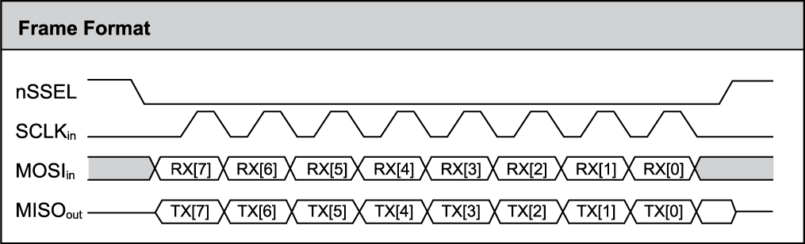

# Hiểu về Frame Data trong giao tiếp SPI (Serial Peripheral Interface) 
- SPI không đươc định nghĩa cứng nhắc từng byte như UART hay I2C (không có các bit Start/Stop hay địa chỉ thiết bị nằm trong dữ liệu)
- Thay vào đó, SPI dựa trên cơ chế thanh ghi dịch (Shift Register) để truyền nhận dữ liệu đồng bộ theo xung nhịp 
- Dưới đây là cấu trúc và thành phần chính của frame dữ liệu SPI:

## Cấu trúc cơ bản của Frame SPI
- **Đồng bộ hóa**: Dựa hoàn toàn vào xung nhịp SCLK (Serial Clock) do Master tạo ra. Mỗi nhịp SCLK thường tương ứng với 1 bit dữ liệu được truyền nhận.
- **Độ dài dữ liệu:** Thường là 8-bit (1 byte), nhưng SPI có thể cấu hình linh hoạt truyền 4, 16, 24, 32 hoặc nhiều bit hơn tùy thuộc vào thiết bị Slave.
- **Truyền song song**: Trong khi Master gửi 1 bit qua chân MOSI (Master Out Slave In), nó cùng đồng thời nhận lại 1 bit từ Slave qua chân MISO (Master In Slave Out) trong 1 chu kỳ xung nhịp.
- **Thứ tự bit**: Thông thường, dữ liệu được truyền MSB trước sau đó mới đến LSB, mặc dù một số thiết bị cho phép truyền LSB trước.

## Thành phần tín hiệu trong khung truyền
- **SS/CS (Slave Select/Chip Select)**: Trước khi truyền, Master kéo chân CS của Slave cần giao tiếp xuống mức thấp (LOW) và giữ nguyên trong suốt quá trình truyền. Khi kết thúc chân này được kéo lên mức HIGH.
- **SLCK**: Master tạo xung clock 
- **MOSI (Master Out Slave In)**: Dữ liệu truyền từ Master đến Slave
- **MISO (Master In Slave Out)**: Dữ liệu truyền ngược từ Slave đến Master

## Cấu hình Frame (SPI Modes)
- Đặc điểm frame dữ liệu của SPI được xác định bởi 4 chế độ (modes) dựa trên sự kết hợp của **CPOL** (Clock Polarity - Cực tính xung) và **CPHA** (Clock Phase - Pha xung):
	- Mode 0 (CPOL = 0, CPHA = 0): Xung nhịp ở mức thấp khi không hoạt động, dữ liệu được lấy mẫu ở cạnh lên (cạnh trước)
	- Mode 1 (CPOL = 0, CPHA = 1): Xung nhịp ở mức thấp khi không hoạt động, dữ liệu được lấy mẫu ở cạnh xuống (cạnh sau)
	- Mode 2 (CPOL = 1, CPHA = 0: Xung nhịp ở mức cao khi không hoạt động, dữ liệu được lấy mẫu ở cạnh lên (cạnh trước)
	- Mode 1 (CPOL = 1, CPHA = 1): Xung nhịp ở mức cao khi không hoạt động, dữ liệu được lấy mẫu ở cạnh xuống (cạnh sau)
	

- Link tham khảo: 