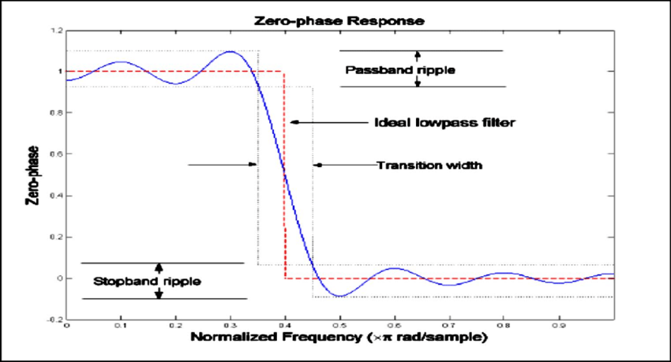
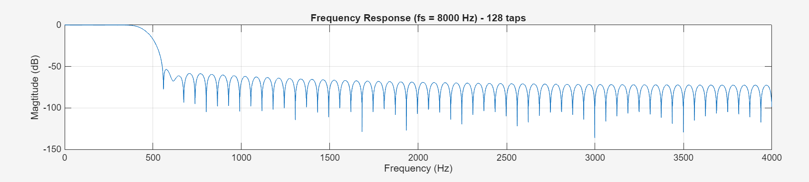

## ĐÁP ỨNG TẦN SỐ CỦA FIR NHÌN RA SAO ? 
Với FIR lowpass, đáp ứng tần số có 3 phần: 
- (1) Dải thông (Passband): Tần số thấp hơn tần số cắt $f_{c}$. Mục tiêu: giữ nguyên biên độ (~0dB)
- (2) Vùng chuyển tiếp (Transition band): Nằm giữa passband và stopband. Mục tiêu càng hẹp thì filter cắt càng sắt
- (3) Dải chắn: Tần số cao hơn $f_{c}$. Mục tiêu: giảm biên độ (suy hao càng nhiều càng tốt)
- Hình ảnh ví dụ đáp ứng FIR thực tế sẽ như thế này: 

- Hình ảnh đáp ứng tần số cho tần số 8000Hz với tần số cắt 450Hz kết hợp cửa sổ hamming:

- Ở passband có ripple nhỏ
- Ở stopband có side-lobes (ripple) dạng răng cưa
- Ở transition band: mở rộng tùy số taps & cửa sổ

### Vì sao lại sinh ra Ripple trong đáp ứng tần số ? 
- Lý do gốc: Do cắt ngắn sinc -> Sinh nhiễu Gibbs 

## CỬA SỔ (WINDOWS) TRONG XỬ LÝ TÍN HIỆU SỐ

## LỢI VÀ HẠI CỦA SỐ TAPS TRONG BỘ LỌC
| Số Tabs | Lợi | Hại |
|---------|-----|-----|
| 32 tabs | - CPU nhanh, mỗi mẫu chỉ cần 32 phép nhân, rất nhẹ cho tính toán   - Độ trễ thấp (delay = N/2 = 16 samples ~ 2ms ở 8kHz)   - Ít RAM, ít Flash| - Độ dốc lọc kém -> stopband attenuation thấp -> Aliasing dễ lọt vào khi downsample 8x   - Transiton band rộng -> khó giữ biên tần chính xác (không sắc cạnh)   - Đôi khi không đủ sạch để lọc PCG trước khi decimation|
| 64 tabs | - Lọc sạch hơn nhiều   - Stopband attenuation cao hơn (40-70 dB)   - Transition band hẹp -> giữ sóng PCG tốt hơn   - Anti-aliasing tốt hơn -> Đặc biệt quan trọng khi Decimation 8x | - CPU tốn gấp đôi -> 64 phép nhân tích chập mỗi mẫu   - Độ trễ tăng (delay = 32 samples ~4ms)   - Tốn RAM gấp đôi |
