# More about AD8232 sensor and how to use it
- Datasheet: 

## OVERVIEW - AD8232 là gì ? 
- AD8232 là một Analog Front-End (AFE) chuyên dụng cho đo tín hiệu ECG
- IC này không phải là một ADC mà có nhiệm vụ:
	- Khuếch đại tín hiệu ECG rất nhỏ (uV-mV)
	- Lọc nhiễu (DC offset, motion artifact, nhiễu điện lưới)
	- Đưa tín hiệu về mức analog phù hợp để MCU đọc ADC 
	- Nói chung đây là 1 IC tương tự 
	


## FEATURES 
- Được tích hợp đầy đủ **Single-lead ECG front-end** (Khối tiền xử lý analog ECG cho 1 kênh đo trước khi vào ADC. Tức là trong 3 điện cực (electrode) của thiết bị cung cấp thì 1 lead (= 1 phép đo hiệu điện thế) bằng cách dùng 2 điện cực đo (LA - RA) **(tín hiệu chung - Common Mode signal)**, có thể thêm 1 điện cực tham chiếu RL (RLD) nhưng không tạo thêm lead mới. AD8232 chỉ nhìn tim ở 1 góc duy nhất).
- Dòng tiêu thụ thấp **~170µA**
- **CMRR (Common Mode Rejection Ratio)** (tỷ lệ loại bỏ chế độ chung: là tỷ lệ giữa độ lợi điện áp vi sai (Ad) và độ lợi điện áp chế độ chung (Acm) trong bộ khuếch đại vi sai như Op-Amp. Nó là chỉ số đo lường khả năng loại bỏ tín hiệu xuất hiện như nhau (đồng thời và cùng pha) trên cả 2 đầu vào (tín hiệu chế độ chung). Một bộ khuếch đại vi sai lý tưởng sẽ có CMRR vô hạn, nhưng thực tế càng cao càng tốt) cao: ~80dB (DC ->60Hz) -> Giảm nhiễu mạnh ở 50/60Hz
- Hỗ trợ 2-electrode hoặc 3-electrode
- Gain cố định **G = 100 (Instrumentation Amplifier)**.
- **DC blocking**: Chấp nhận offset điện cực lên tới ±300 mV
- **High-pass filter**: 
	- 2-pole, tần số cắt điều chỉnh bằng linh kiện ngoài 
	- Dùng để loại bỏ baseline wander và motion artifact (chuyển động cơ thể) 
- **Low-pass filter**: 
	- 3-pole, dùng Op-Amp A1 tích hợp bên trong 
	- Giảm nhiễu cao tần, EMG
- **Right Leg Drive (RLD)** (điện cực tham chiếu) tích hợp -> Cải thiện CMRR
- **Fast Restore**: phục hồi nhanh sau khi electrode bị tháo/lắp
- **Lead-offs detection** (Phát hiện mất kết nối điện cực) - Điều này giúp đảm bảo tính chính xác và liên tục của việc đo (chạy bằng cách liên tục kiểm tra trở kháng giữa các điện cực): 
	- DC mode (3-electrode)
	- AC mode (2-electrode)
- **Reference buffer** tạo virtual ground (mid-supply): Tạo "GND" giả để xử lý tín hiệu âm-dương bằng nguồn đơn. Nó là 1 mức điện áp giả đóng vai trò "0V" cho tín hiệu Analog thường nằm giữa VCC và GND. Giá trị đó tầm 1.65V
	- Vì AD8232 chạy **nguồn đơn (single-supply)** mà tín hiệu ECG thật là tín hiệu xoay chiều quanh 0V. Nhưng Op-Amp không xử lý được điện áp âm -> Sinh ra Virtual Ground bằng cách nâng tín hiệu ECG lên quanh giá trị GND giả đó
	- Tạo ra điện áp ổn định, trở kháng thấp. Xuất ra tại chân **REFOUT**
- **Op-Amp Rail-to-rail output**: Ngõ ra tín hiệu có thể giao động rất sát 2 "rail (thanh ray)"nguồn GND và VCC (Low Rail = GND, High Rail = VCC (3.3V))
- Single Supply: 2.0V - 3.5V 
- ESD protection: lên tới 8kV (HBM)
- Chân shutdown (SND) cho thiết bị chạy bằng pin 

## AD8232 BÊN TRONG GỒM NHỮNG KHỐI GÌ ? 
- AD8232 tích hợp nhiều khối analog chuyên dụng 

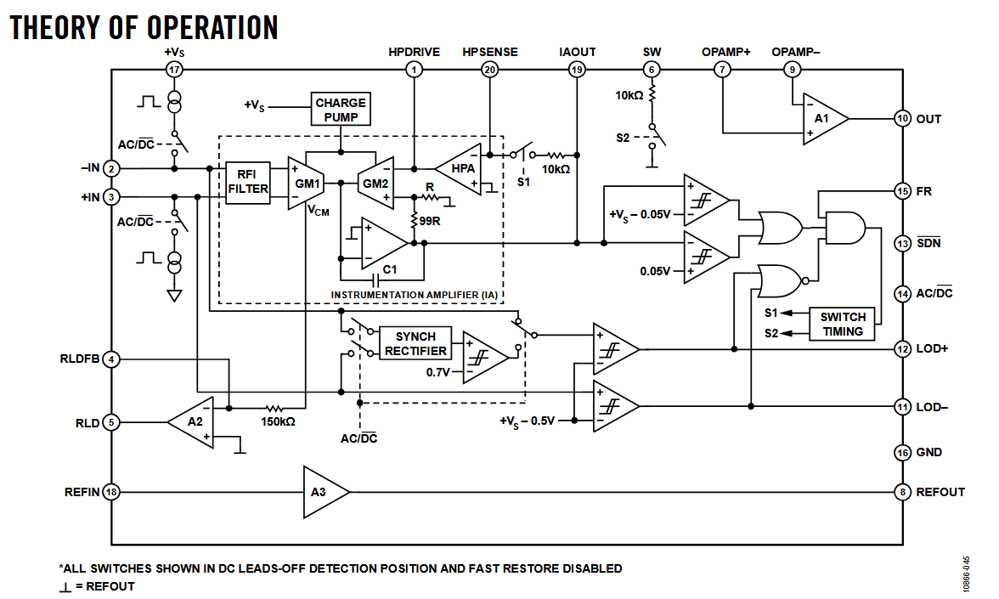

**1. Instrumentation Amplifier (IA)**
- Khuếch hiệu điện thế giữa 2 điện cực 
- Gain cố định: 100 V/V
- Kiến trúc **indirect current feedback**
- Cho phép: 
	- Khuếch đại ECG
	- Đồng thời chặn DC offset lớn (±300 mV)
- Output của IA nằm tại chân **IAOUT**. Nó là đầu ra của tín hiệu sau khi đã được xử lý nội bộ (khuếch đại, lọc nhiễu,...bên trong)


**2. High-pass Filter (DC blocking)**

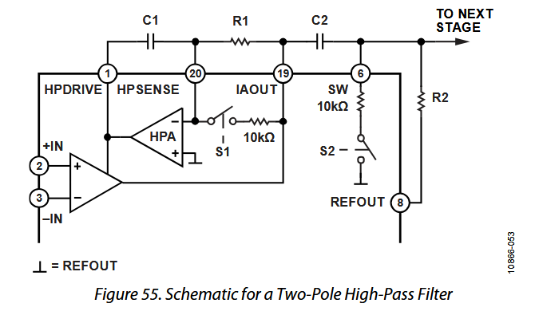

- Kiến trúc HPF cho AD8323 không phải Op-amp thường mà được thiết kế theo kiến trúc đặc biệt bao gồm HPA - DC blocking amplifier, Fast restore switches và đường dây feedback đặc biệt của **IA**
- Khối HPA có 2 chân giao tiếp: 
	- **HPDRIVE**: là ngõ ra điều khiển (drive output) của khối HPA (High-Pass Amplifier). Mục tiêu: Dùng để bơm xả điện tích vào tụ HPF, kéo mức DC của IAOUT về **REFOUT** (tay đẩy)
	- **HPSENSE**: là ngõ vào cảm nhận (sense input) của khối HPA. Nối vào điểm giữa R-C của mạch HPF. Để HPA "nhìn xem" mức DC hiện tại đang lệch bao nhiêu (mắt đo)
	- **RC ngoài**: tích hợp vào 2 chân trên để tạo thành 1 bộ HPF mạnh hơn
- **HPSENSE** - đo sai lệch DC và **HPDRIVE** - phản hồi để triệt DC -> DC offset bị loại bỏ, AC(ECG) đi qua
- Mục đích: Loại bỏ Electrode half-cell potential, Baseline wander 


- Ngoài ra, theo datasheet, người dùng cũng có thể tự cấu hình thêm HPF bằng mạch tương tự bên ngoài (lên đến 3-pole) để có thể tăng khả năng lọc nhiễu, thay đổi tần số cắt tùy ý. Nếu không mắc mạch RC thì không lọc nhiễu tốt được.
- Các cấp độ lọc HPF: 
	- Level 1: HPF 1 pole (mặc định) 
		- Dùng DC-blocking bên trong, mắc 1 RC, ít méo dạng, phổ biến cho ECG waveform 
	- Level 2: HPF 2 pole 
		- Mắc thêm 1 RC ngoài ở sau IA, kết hợp với SW + fast restore, lọc baseline tốt hơn 
	- Level 3: HPF 3 pole 
		- Kết hợp HPF nội, RC ngoài, AC coupling sau IA

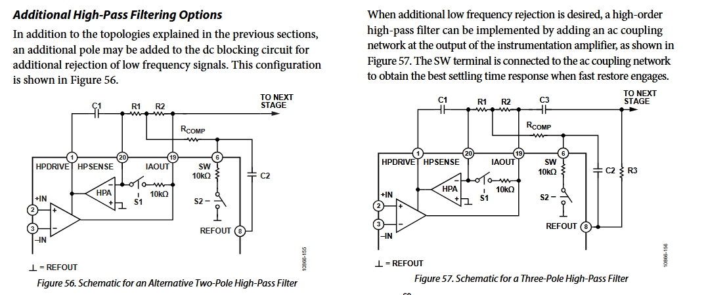

- Công thức tính tần số cắt: 
	
$$\f_{c} = frac{1}{2\piRC x 100}$$

> Hệ số 100 ở trên công thức là do gain của IA
- HPF của AD8232 có sẵn kiến trúc bên trong, nhưng...HPF không tự chạy nếu không tự mắc linh kiện RC bên ngoài. Đặc biệt nếu cần mạnh hơn thì có thể thêm các pole bên ngoài

** 3. Low-pass Filter + Gain Stage (Op-Amp A1)
- **Op-Amp A1 uncommitted rail-to-rail** tích hợp. Đây là bộ khuếch đại thuật toán có dải điện áp đầu vào (input) và đầu ra (output) có thể dao động rất gần với các đường ray nguồn cung cấp (cả dương và âm/đất)
	- Op-Amp đẩy điện áp ra gần 0V và kéo lên gần VCC. Ví dụ AD82323 (VCC = 3.3V) -> Vout ~ 0.1V -> 3.2V (tùy dải)
	- Cho phép tận dụng tối đa phạm vi điện áp hoạt động, đặc biệt hữu ích trong các hệ thống nguồn đơn (single-supply) điện áp thấp
	- Nếu không sử dụng rail-to-rail, Op-Amp thường chỉ ra được từ 0.8V - 2.5V (ví dụ) -> Mất **dynamic range**, ECG nhỏ dễ bị méo

- Op-Amp A1 này ngoài việc được cấu hình **rail-to-rail output**, USER còn có thể cấu hình nó: 
	- Buffer: Chỉ nối voltage follower, không lọc, giữ nguyên biên độ
	- **Khuếch đại thêm**: Thêm gain sau IA. Ví dụ tổng gain = 100 (Gain mặc định)x 11 = 1100
	- **Tạo LPF** (Sallen Key, lọc RC,...): Đây chính là lúc bạn tự cấu hình LPF cho thiết bị. 
		- Nếu dùng mạch RC đơn giản -> LPF 1 pole
		- Thiết kế mạch Sallen-Key -> LPF 2 pole (chuẩn ECG)
		- Cutoff do USER quyết định

- Lưu ý: AD8232 chỉ có sẵn kiến trúc cho HLF bên trong, còn LPF là do người dùng tự thiết kế bên ngoài cho Op-Amp A1 tích hợp bên trong. 
	- Bên trong chỉ có 1 Op-Amp rời (Op-Amp A1). Op-Amp này không tự lọc, không tự có cutoff, chỉ là Op-Amp trống. Muốn thành LPF -> Phải tự mắc linh kiện bên ngoài
	- Nhà sản xuất chỉ tích hợp sẵn Op-Amp còn lọc thế nào là tùy theo ứng dụng của người dùng

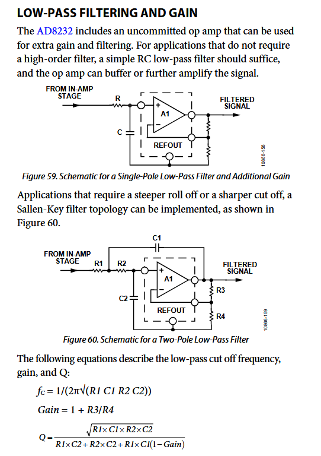

- Tần số cắt LPF thường dùng: 
	- 40Hz (ECG waveform)
	- 20-25Hz (Heart rate only)

### Note: Tuy nhiên, đó chỉ là về phần IC, còn module AD8232 màu đỏ trên thị trường đã được tích hợp sẵn các linh kiện RC để lọc HPF và LPF. Người dùng chỉ cần cấp nguồn và đọc OUTPUT

**4. Right Leg Drive (RLD)**
- Đảo pha **Common-Mode voltage** (Điện áp chung)
- Bơm ngược lại cơ thể qua điện cực RL
- Mục tiêu: Giảm nhiễu 50/60Hz (như đã đề cập trên CMRR), ổn định mức **Common-Mode**
- Khuyến nghị: Có điện trở hạn dòng ≥ 330 kΩ, dòng qua cơ thể < 10 µA (an toàn sinh học)
- Đầu ra của Op-Amp A2

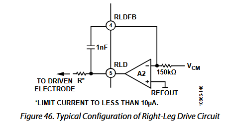

**5. Reference Buffer (Virtual Ground)**
- Tạo mức điện áp Vref ~ VCC / 2
- Output tại chân **REFOUT**
- Tất cả tín hiệu ECG giao động quanh mức này
- MCU ADC nên dùng **REFOUT** làm reference hoặc mid-scale
- Tín hiệu tại chân **OUTPUT** là Analog Voltage với mức điện áp giao động quanh **REFOUT**

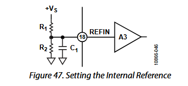

**6. Fast Restore Circuit**
- Kích hoạt khi IA bị saturation (do electrode off, di chuyển mạnh)
- Hoạt động: Tạm thời tăng tần số cắt HPF, xả nhanh điện tích trên tụ 
- Giúp tín hiệu ổn định lại trong vài chục ms, không phải chờ vài giây như HPF thông thường


**7. Leads-Off Detection**
- DC Mode (3 điện cực): 
	- Phát hiện điện cực nào bị rơi
	- Xuất tín hiệu tại chân **LOD+** và **LOD-**
	
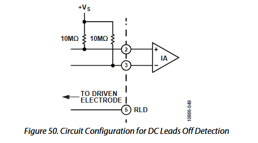

- AC Mode (2 điện cực):
	- Dùng dòng AC ~ 100kHz, 200nA
	- Chỉ phát hiện có bị rơi hay không, không phân biệt điện cực
	
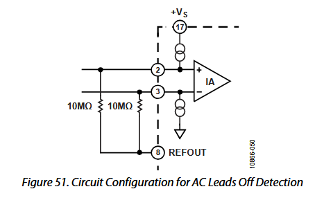

## ĐƠN VỊ TÍN HIỆU ECG TRONG AD8323

|Giai đoạn|Đơn vị|
|---------|------|
|Trên da| µV – mV|
|Sau IA| mV - V|
|Chân OUT| Volt(Analog)|
|ADC MCU|Code số (0 -> 2ⁿ−1)|


# More about INMP441 sensor and how to use it
- Datasheet: 

## FEATURES
- Là cảm biến MEMS (Micro-Electro-Mechanical Systems - Hệ thống vi cơ điện tử) microphone hiệu năng cao, năng lượng thấp, đầu ra số
- Chuẩn giao thức I2S với độ chính xác dữ liệu 24-bit. I2S cho phép INMP441 kết nối trực tiếp với bộ xử lý số như DSPs hoặc MCU mà không cần đi qua bộ **Codec**
- SNR (Signal-to-Noise) cao (62 dBA)
- Độ nhạy môi trường -26 dBFS
- **Flat Frequency Response (đáp ứng tần số phẳng)** từ 60Hz -> 15kHz (khả năng tái tạo âm thanh môi trường lại một cách trung thực mà không làm thay đổi âm sắc gốc). Đây là giới hạn vật lý của màng micro + cấu trúc MEMS mà mic có thể thu tốt một cách tự nhiên mà không bị méo hay biến dạng quá nhiều
	> - Frequency Response (đáp ứng tần số) là phép đo định lượng của phổ tần số đầu ra của một hệ thống hoặc thiết bị khi phản ứng với một kích thích tần số từ môi trường. Có thể hiểu đơn giản là việc thiết bị hoặc hệ thống phản ứng thế nào khi ta đưa vào các tín hiệu có tần số khác nhau (có bị méo, mạnh yếu ra sao)

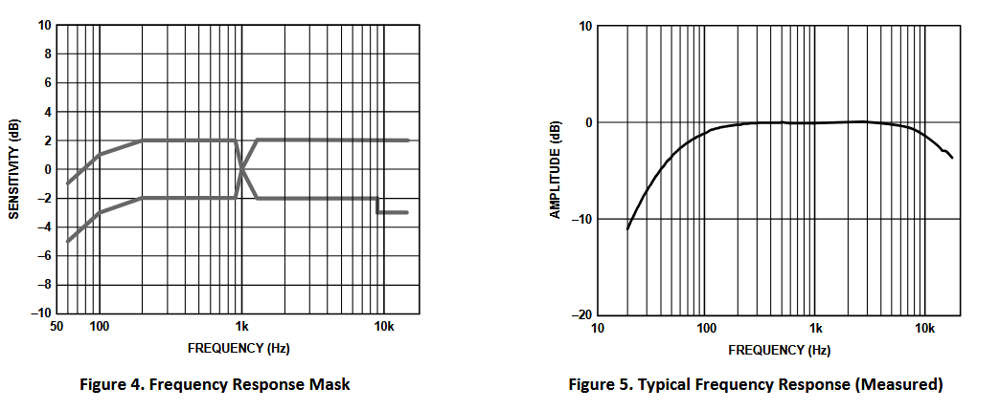

- Dòng tiêu thụ thấp (tối đa 1.4mA với chế độ *Normal Operation*)
- Áp lực âm thanh có thể chịu đựng: 160 dB
- PSR (Power Supply Rejection - Loại bỏ nhiễu nguồn) lên đến -75 dBFS

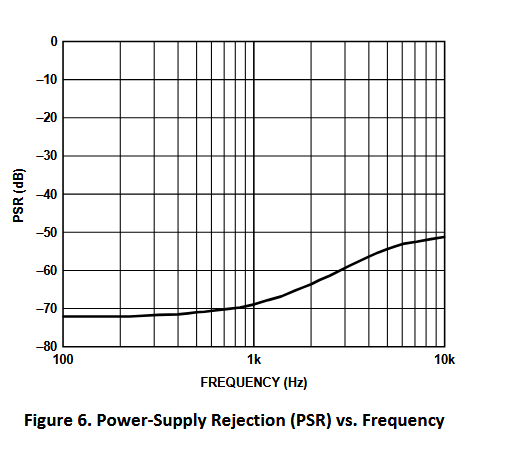

- Hỗ trợ bộ lọc số (Digital Signal Processor) phần cứng bên trong cảm biến. Cụ thể:
	- **Group Delay (Độ trễ nhóm)**: *17.2 / fs (s)* - Đây là đỗ trễ của tín hiệu khi đi qua bộ lọc số tích hợp bên trong mic (DSP filter). Đây là độ trễ nội bộ của mic, không phải của MCU hay DMA. Nó rất quan trọng khi muốn đồng bộ các cảm biến với nhau. Ví dụ với 2 tần số lấy mẫu:
		- fs = 48 kHz -> Group delay ~ 0.36ms (36us)
		- fs = 16 kHz -> Group delay = 1.078ms (1078us)
	- **Pass band Ripple (Độ gợn trong dải thông)**: ±0.04 dB. Bộ lọc bên trong mic cho tín hiệu trong dải tần số sử dụng méo rất nhỏ, gần như không đáng kể. Tín hiệu được giữ nguyên biên độ gần như hoàn toàn
	- **Stop band Attenuation (Độ suy giảm dải dừng)**: 60 dB. Bộ lọc sẽ giảm ít nhất 60 dB ở các tần số cao hơn dải thông (noise, nhiễu aliasing - nhiễu răng cưa). Tức là tần số nằm ngoài dải mic sẽ bị giảm 1000 lần về biên độ, giúp tín hiệu thu được sau mic sạch hơn và giảm aliasing khi ghi âm
	- **Pass band (Dải thông)**: *fs x 0.423*. Dải thông này là phạm vi lọc của DSP bên trong mic, tín hiệu đi qua sẽ không bị méo. Nếu vượt qua ngưỡng của Pass band thì nó sẽ bị suy giảm bởi Stop band Attenuation ở trên. Thông dải lọc phụ thuộc vào tần số lấy mẫu. Ví dụ:
		- fs = 48 kHz -> Pass band = 20.3 kHz (Mic cho tín hiệu tốt đến ~20 kHz) -> Thu âm full audio
		- fs = 16 kHz -> Pass band = 6.77 kHz (Mic cho tín hiệu tốt đến ~6.77 kHz) -> Phù hợp cho giọng nói

- Ngoài ra, nhà sản xuất cũng khuyến cáo thiết bị nhạy cảm với tĩnh điện (ESD - Electrostatic Discharge). Tuy bên trong cũng được tích hợp mạch bảo vệ độc quyền nhưng thiết bị vẫn có thể bị ảnh hưởng bởi ESD năng lượng cao
- Theo datasheet, để đạt hiệu suất tốt nhất và tránh các hiện tượng ký sinh tiềm ẩn (Parastic Artifacts), rất khuyến nghị đặt 1 tụ điện gốm loại 0.1uF hoặc tốt hơn ở giữa chân Vcc và chân Gnd. Càng gần càng tốt
## CHUẨN I2S TRONG INMP441 HOẠT ĐỘNG THẾ NÀO ? 
- Cổng nối tiếp kiểu slave là I2S, 24-bits, sử dụng định dạng bù hai (**two complement**). Phải có 64 chu kỳ xung nhịp SCK trong mỗi khung WS stereo hoặc 32 chu kỳ SCK trong nửa khung WS mon cho mỗi từ dữ liệu.
- Chân điều khiển **L/R** xác định liệu INMP441 có xuất dữ liệu ở kênh trái (Left) hay kênh trái (Right)
- Độ dài dữ liệu (data word length): Độ dài từ dữ liệu xuất là 24-bit trên mỗi kênh. INMP441 luôn có 64 chu kỳ xung nhịp cho mỗi từ dữ liệu (**f_sck = 64 x f_ws**)
- Định dạng Từ dữ liệu (Data-word Format): Định dạng dữ liệu mặc định là I2S (bù hai), MSB là bit đầu tiên (từ trái sang phải). 
	- Trong định dạng này, MSB của mỗi từ bị trì hoãn 1 chu kỳ SCK kể từ lúc bắt đầu mỗi nửa khung (trước khi bắt đầu chu kỳ SCK cho MSB thì sẽ bị trễ 1 khung đầu)

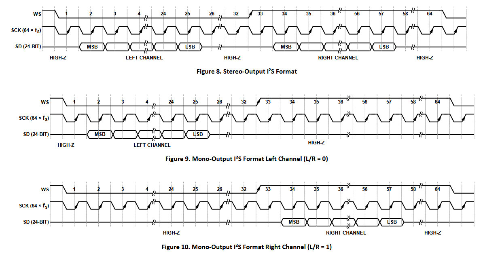

- I2S có 3 loaị clock chính: 

|Clock | Tên khác| Vai trò|
|------|---------|--------|
|BCLK (SCK)| Bit clock | Clock để dịch từng bit dữ liệu PCM|
|LRCLK (WS)| Frame clock | Xác định mẫu trái/phải -> Chính là sample rate fs|
|MCLK | Master clock | Clock nền tốc độ cao cho ADC/DAC được cấp từ bên ngoài cho thiết bị Audio (vd: MCU)|

- **Master clock (MCLK)** của I2S là clock "gốc" được cấp cho các thiết bị audio như ADC, DAC hoặc Codec để chúng hoạt động ổn định từ đó tạo ra các clock nội bộ (hay còn được gọi là **Oversampling Clock**) để chạy ADC/DAC/Codec hay clock cho BLCK/LRCLK (Bản chất I2S)
- Nhiều thiết bị audio cần 1 clock nhanh và ổn định. Giá trị của MCLK thường là bội số của:
	- 256 x Fs
	- 384 x Fs
	- 512 x Fs
	- Chúng là các hệ số của chuẩn công nghiệp cho clock nội bộ của các ADC/DAC audio. Chúng yêu cầu oversampling và digital filtering, vốn chạy nhanh gấp hàng trăm lần tần số lấy mẫu.
	
- Riêng INMP441 là ngoại lệ. Nó không cần **MCLK truyền thống**. Clock I2S như chân BCLK và LRCLK đến trực tiếp từ MCU để nó hoạt động, bởi vì:
	- INMP441 không phải DAC, không phải audio codec mà lại 1 microphone MEMS với ADC sigma-delta tích hợp sẵn. 
	- Không cần clock nội bộ (oversampling clock) từ bên ngoài, tự tạo bằng mạch điều chế sigma-delta 
	- Chỉ cần biết khi nào xuất dữ liệu -> Do BCLK và LRCLK điều khiển
	- INMP441 chỉ cần MCU cấp tempo (nhịp), nhưng không cần MCU cấp clock xử lý nội bộ

- INMP441 tự sinh ra clock nội bộ (oversampling clock) bên trong:
	- Clock này được MCU cấp trực tiếp qua đầu vào chính BCLK và LRCLK rồi từ đó INMP441 sẽ dùng PLL (Vòng khóa pha) bên trong mạch để tạo ra clock nội bộ (Oversampling clock) cho ADC chạy 
	- Thường là hàng MHz (4 - 6 MHz) đề dùng cho sigma-delta ADC và sau đó là decimate xuống theo Fs, theo LRCLK
	
- Một frame của I2S gồm: 
	- 1 cạnh của LRCLK (Left)
	- N bit trên SCK (BCLK)
	- 1 cạnh của LRCLK (Right)
	- N bit tiếp theo
- Tổng cộng 2 x N bit mỗi mẫu. Với INMP441: N = 24 hoặc 32 bit (thường 32-bits/frame)

### Quan hệ giữa BCLK, LRCLK và Sample rate
- Công thức chuẩn I2S:
```ini
BCLK = LRCLK(Fs) x BitsPerSample x Channels
```

- Với 2 kênh (Left + Right):
```ini
BCLK = Fs x BitsPerSample x 2
```
- Thông thường BitsPerSample = 32
- Ví dụ muốn Fs = 16kHz: 
```makefile
BCLK = 16000 × 32 × 2
     = 1,024,000 Hz (1.024 MHz)
```

## I2S Digital INPUT/OUTPUT CHARACTERISTICS 
- Digital Input (Đầu vào số) bao gồm các chân L/R, WS, SCK. Phụ thuộc vào điện áp đầu vào (Vdd):
	- Input Voltage High (V_ih): Điện áp tối thiểu để mic hiểu là logic 1. Từ min: 0.7 x Vdd -> max: Vdd
		- Ví dụ: Vdd = 3.3V -> V_ih ≥ 2.31V
	- Input Volatage Low (V_il): Điện áp tối đa để mic hiểu là logic 0. Từ min: 0 -> max: 0.25 x Vdd
		- Ví dụ: Vdd = 3.3V -> V_il ≤ 0.825V
	- MCU phải đảm bảo mức điện áp đầu ra BCLK/LRCLK đạt mức này để INMP441 nhận đúng tín hiệu

- SD digital input (đọc tên hơi nhầm, thực ra là đặc tính output vì mic xuất dữ liệu SD ra cho MCU). Bảng này mô tả:
	- Điện áp output khi ở mức 0 (VOL)
	- Điện áp output khi ở mức 1 (VOH)
	- Ứng với từng mức Vdd
	- Ví dụ: nếu Vdd = 3.3V và tải nhẹ:
		- VOL ≤ 0.3 x Vdd -> Khoảng 0.99V
		- VOH ≥ 0.9 x Vdd -> Khoảng 2.97V
	- Tức là chân SD sẽ xuất chuẩn mức CMOS
	
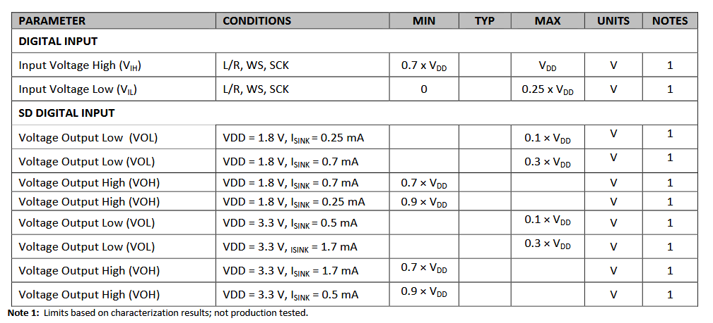

## SERIAL DATA PORT TIMING SPECIFICATIONS
- Là thông số thời gian giao tiếp I2S. Thể hiện thời gian giữ mức cao - thấp của xung clock được cấp cho mic. Cụ thể
	- t_SCH - thời gian SCK HIGH phải ≥ 50ns
	- t_SCL - thời gian SCK LOW phải ≥ 50ns
	- Thời gian SCK tối thiểu (chỉ tính thời gian xung ở HIGH + xung ở LOW): t_SCH + t_SCL ≥ 100ns. 
	- Chu kỳ clock SCK (thời gian hoàn thành 1 chu kỳ xung) t_SCP ~ 312ns. Đây là tần số bit clock mà mic có thể xử lý
	- Tần số cấp cho chân SCK hoạt động (hay BLCK - clock để gửi từng bit dữ liệu I2S) nằm trong phạm vị 0.5MHz -> 3.2MHz (MCU làm master clock để tạo xung trong dải này cho cảm biến)
	- t_WSS (WS setup): thời gian chân WS phải ổn định **trước** cạnh đầu của SCK (giá trị ≥ 0ns)
	- t_WHS (WS Hold time): Thời gian WS phải giữ ổn định sau cạnh SCK -> WS cần giữ 1 chút để mic đọc đúng frame (giá trị ≥ 20ns)
	- f_WS (WS frequency): là tần số LRCLK hay tần số clock của Left/Right (tần số này cũng chính là sample rate). Đây là clock xác định:
		- Xung lên -> Kênh trái
		- Xung xuống -> Kênh phải
		- FS = LRCLK = số frame/giây mà INMP441 gửi ra

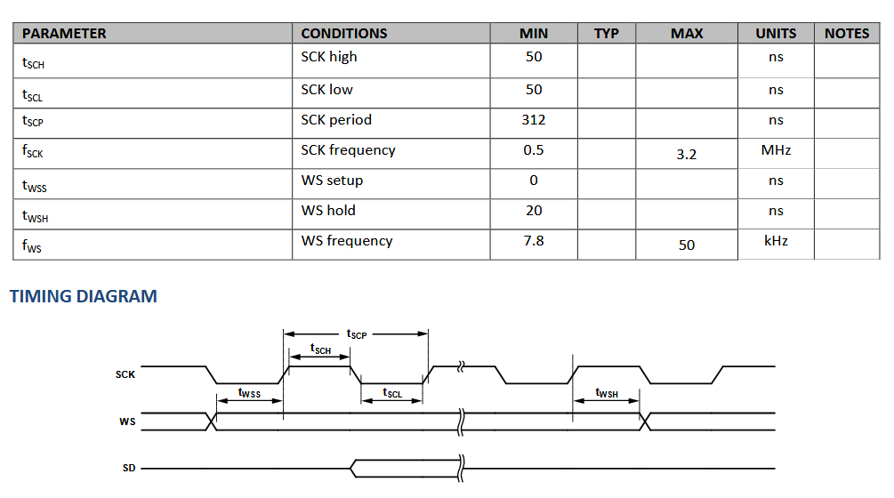

## PIN FUNCTION DESCRIPTIONS

|PIN|NAME|FUNCTION|
|---|----|--------|
|1|SCK (Serial-Data Clock)|Chân cấp xung clock để dịch bit dữ liệu cho I2S (clock này được cấp từ MCU)|
|2|SD (Serial-Data)|Ngõ dữ liệu xuất ra của I2S. Chân này sẽ chuyển sang trạng thái ba mức (**tri-state**) khi không chủ động xuất ra dữ liệu cho kênh tương ứng. Đường tín hiệu SD nên có 1 điện trở kéo xuống 100k Ohm để xả điện tích dư thừa về GND trong trường hợp trên bus I2S có nhiều microphones cùng lúc vì tại một thời điểm, chỉ có 1 microphones được phép kéo đường SD lên/xuống. Các microphones khác phải đưa chân SD về trạng thái **tri-state** để tránh xung đột tín hiệu|
|3|WS (Word Select)| Chân clock cho việc chọn dữ liệu được đọc kênh trái hay bên phải - cũng chính là LRCLK (clock được cấp từ MCU)|
|4|LR (Left Right)| Chân chọn kênh trái/phải. Khi chân này LOW (nối với GND) -> data sẽ được đọc kênh bên trái. Khi chân này HIGH (nối với VCC) -> data sẽ được đọc kênh ở bên phải|

### Chế độ xuất dữ liệu (Data output mode)
- Chân SD ở trạng thái trở kháng cao (tri-stated hay HIGH-Z) khi nó không tích cực điều khiển dữ liệu I2S. Chân SD chuyển sang trạng thái HighZ ngay lập tức sau khi LSB được xuất, để một microphone khác có thể điều khiển đường dữ liệu chung (nếu có)
- Đường truyền SD nên có 1 điện trở **pull-down** để xả tích điện trong trên đường dây trong khoảng thời gian mà tất cả các microphone trên bus đều chuyển sang trạng thái trở kháng cao, cũng như để tránh hiện tương GPIO *floating* và xác định trạng thái của chân đó

### Trạng thái tri-state là gì ?
- Là trạng thái trở kháng cao hay High Impedence State - viết tắt là **HighZ** hoặc **tri-state**
- Đây là trạng thái thứ ba của một chân digital (ngoài HIGH và LOW)
- Khi một chân ở trạng thái HighZ, mạch điện tử bên trong điều khiển chân đó sẽ ngắt kết nối khỏi đường dây (bus) hoặc chuyển sang 1 trạng thái có trở kháng đầu ra cực kỳ lớn
- Chân đó sẽ **không chủ động** kéo điện áp đường đây lên mức HIGH (nối với Vcc) hoặc xuống mức LOW (nối với GND). Do không bị kéo lên hay kéo xuống bởi thiết bị, đường dây được nối với chân HighZ này sẽ ở trạng thái *floating*. Trạng thái này có nghĩa là điện áp trên đường dây không được xác định rõ ràng và dễ bị ảnh hưởng bởi nhiễu điện từ
- Mục đích là để tránh xung đột bus vì tại 1 thời điểm chỉ có 1 thiết bị được phép truyền dữ liệu -> Khi đó các thiết bị khác phải ở trạng thái HighZ


